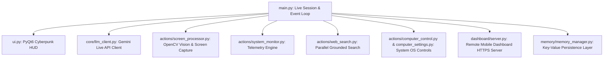

<div align="center">

# 🤖 J.A.R.V.I.S. AI
### Real-Time Conversational & Visual Autonomous AI Desktop Assistant

[](https://www.python.org/)
[](LICENSE)
[](SUPPORTED_VERSIONS.md)
[](SECURITY.md)

</div>

---

## 🛠️ Complete Tech Stack

J.A.R.V.I.S. AI is engineered using modern, production-grade Python technologies:

- 🧠 **Core AI Engine**: Google Gemini Live API (`google-genai` SDK) via bidirectional WebSockets.
- 🎨 **User Interface**: PyQt6 with custom vector `HudCanvas` rendering, real-time waveform visualizers, and Ethnocentric / Source Code Pro typography.
- 👁️ **Computer Vision & Perception**: OpenCV (`cv2`) hardware video capture and `mss` high-speed screen frame grabbing.
- 🎙️ **Audio Processing**: `PyAudio` raw PCM streaming, signal processing, and low-latency buffer queues.
- ⚙️ **System Control & Telemetry**: `psutil` hardware monitoring (CPU, RAM, GPU, Temp) and OS-native automation.
- 🌐 **Web Automation & Search**: `Playwright` browser automation and grounded multi-mode Google / DuckDuckGo search.
- 📱 **Remote Dashboard**: `FastAPI`, `Uvicorn`, and `cryptography` (AES-256 & local self-signed SSL certificates).

---

## ⚡ Getting Started Workflow

### Prerequisites
- **Python**: Make sure **Python 3.11 or 3.12** is installed on your computer beforehand ([Download Python](https://www.python.org/downloads/)).
- **Hardware**: Microphone and webcam connected.
- **API Key**: Free Gemini API key from [Google AI Studio](https://aistudio.google.com/).

---

### Step 1: Obtain the Project

#### Option A: Clone with Git
```bash
git clone https://github.com/ankitpaul6201/Personal-Ai-Assistant.git
cd Personal-Ai-Assistant
```

#### Option B: Download ZIP
1. Click **Code ➔ Download ZIP** on GitHub (or download `Personal-Ai-Assistant-main.zip`).
2. Extract the `.zip` archive to a folder on your computer.
3. Open a Terminal / Command Prompt inside the extracted folder.

---

### Step 2: Run First-Time Setup Wizard

Run the automated setup script:

```bash
python setup.py
```

The interactive setup wizard will:
1. Verify Python version compatibility.
2. Install all required dependencies (`pip install -r requirements.txt`).
3. Guide you through entering your **Gemini API Key**, **Assistant Name**, and **User Title**.
4. Create your secure local configuration file (`config/api_keys.json`).

---

### Step 3: Launch J.A.R.V.I.S. AI

Once setup is complete, start the assistant by running:

```bash
python main.py
```

---

## 🏗️ System Architecture



---

## 🔒 Security & Secret Management

- **Local Secrets & Isolation**: API keys (`config/api_keys.json`) and personal memory files (`memory/long_term.json`) are stored strictly on your local computer and excluded from Git commits via `.gitignore`.
- **Dynamic Local Certificates**: Dashboard HTTPS server auto-generates a unique local SSL certificate (`2048-bit RSA`) on demand — no static private keys are ever stored or committed.
- **Redaction Engine**: Automated secret masking (`core/security.py`) filters API key patterns from all logs and UI elements.
- **Boundary Checks**: File operations validate path bounds (`validate_safe_path`) preventing directory traversal vulnerabilities.

---

## 📄 Governance & Open Source

- [LICENSE](LICENSE) — MIT License
- [SECURITY.md](SECURITY.md) — Security Policy & Vulnerability Protocol
- [CODE_OF_CONDUCT.md](CODE_OF_CONDUCT.md) — Contributor Code of Conduct
- [CONTRIBUTING.md](CONTRIBUTING.md) — Development Setup & Guidelines
- [THIRD_PARTY_LICENSES.md](THIRD_PARTY_LICENSES.md) — Dependency Licenses
- [SUPPORTED_VERSIONS.md](SUPPORTED_VERSIONS.md) — Platform Support Matrix

---

## 👤 Maintainer

Engineered by **[ankitpaul](https://github.com/ankitpaul6201)**