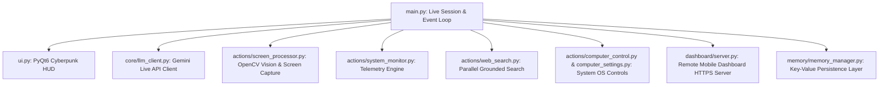

<div align="center">

# 🤖 J.A.R.V.I.S. AI
### Real-Time Conversational & Visual Autonomous AI Desktop Assistant

[](https://www.python.org/)
[](LICENSE)
[](SUPPORTED_VERSIONS.md)
[](SECURITY.md)

</div>

---

## 📌 Overview

**J.A.R.V.I.S. AI** is an enterprise-ready, cross-platform personal AI assistant engineered around the **Gemini Live API**. It features real-time bidirectional audio streaming, native desktop and camera computer vision, hardware telemetry monitoring, autonomous system control, grounded web search, and dynamic UI theme customization.

---

## 🏗️ System Architecture



---

## ✨ Core Features

| Subsystem | Capabilities |
| :--- | :--- |
| 🎙️ **Voice Engine** | Native zero-latency audio streaming via Gemini Live API WebSocket connection |
| 👁️ **Visual Perception** | Concurrent camera stream and desktop screen capture (`mss` / `OpenCV`) |
| ⚙️ **System Control** | Volume, screen brightness, WiFi, task manager, and shortcut automation |
| 📊 **Hardware Telemetry** | Live CPU, RAM, GPU, and temperature telemetry with automated alerts |
| 📋 **Clipboard Intelligence** | One-click translate, summarize, explain, and debug floating panel |
| 🎨 **Dynamic UI Engine** | Custom PyQt6 arc-reactor paint engine, color wheel picker, and status widgets |
| 📱 **Remote Dashboard** | Mobile pairing HTTPS server with encrypted AES-256 session pairing |

---

## 🔒 Security & Privacy Model

- **Local Secret Isolation**: API keys (`config/api_keys.json`) and personal memory stores (`memory/long_term.json`) are stored strictly on your local device and excluded from Git commits via `.gitignore`.
- **Automatic Secret Redaction**: All log outputs and UI traces sanitize API keys using centralized secret masking (`core/security.py`).
- **Path Traversal Protection**: File operations strictly enforce boundary checks (`validate_safe_path`) preventing directory traversal attacks.
- **HTTP Security Headers**: Dashboard server enforces `Content-Security-Policy`, `X-Frame-Options: DENY`, and `X-Content-Type-Options: nosniff`.

---

## ⚡ Quick Start

### 1. Prerequisites
- **Python**: `3.11` or `3.12`
- **Audio & Video**: Microphone and webcam
- **API Key**: Gemini API key from [Google AI Studio](https://aistudio.google.com/)

### 2. Installation

```bash
# Clone repository
git clone https://github.com/ankitpaul6201/Personal-Ai-Assistant.git
cd Personal-Ai-Assistant

# Create virtual environment
python -m venv .venv
# On Windows:
.venv\Scripts\activate
# On macOS/Linux:
source .venv/bin/activate

# Install dependencies
pip install -r requirements.txt
```

### 3. Configuration

Initialize local configuration from template:

```bash
cp config/api_keys.json.example config/api_keys.json
```

Edit `config/api_keys.json`:
```json
{
    "gemini_api_key": "YOUR_GEMINI_API_KEY_HERE",
    "os_system": "Windows",
    "assistant_name": "JARVIS",
    "user_name": "sir",
    "ui_color": "#00e5ff"
}
```

### 4. Running the Assistant

```bash
python main.py
```

---

## 🧪 Testing & Code Quality

Run the automated unit and security test suite:

```bash
python -m unittest discover tests
```

---

## 📄 Open Source Governance

- [LICENSE](LICENSE) — MIT License
- [SECURITY.md](SECURITY.md) — Security Policy & Disclosure Protocol
- [CODE_OF_CONDUCT.md](CODE_OF_CONDUCT.md) — Contributor Code of Conduct
- [CONTRIBUTING.md](CONTRIBUTING.md) — Development Setup & PR Guidelines
- [THIRD_PARTY_LICENSES.md](THIRD_PARTY_LICENSES.md) — Dependency Attributions
- [SUPPORTED_VERSIONS.md](SUPPORTED_VERSIONS.md) — Platform Support Lifecycle

---

## 👤 Maintainer

Engineered by **[ankitpaul](https://github.com/ankitpaul6201)**