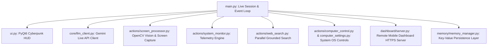

# J.A.R.V.I.S. AI — Complete Codebase Audit & Architectural Analysis Report

**Author**: Senior Software Engineering & Security Team  
**Date**: July 2026  
**Repository**: [Personal-Ai-Assistant](https://github.com/ankitpaul6201/Personal-Ai-Assistant)  
**Version**: 1.0.0-prod  

---

## 1. Architectural Layout & Component Map

### Core Architecture Components

1. **Main Event Loop (`main.py`)**:
   - Manages the asynchronous Gemini Live WebSocket session (`google-genai` / `PyAudio`).
   - Coordinates tool call dispatching across sub-modules.
   - Handles multi-modal streams (audio input/output, vision frame buffers, tool response loops).

2. **PyQt6 HUD Interface (`ui.py`)**:
   - Renders a multi-threaded cyberpunk-styled desktop interface.
   - Features dynamic arc-reactor style visualizers, `HudCanvas` custom paint engine, hardware telemetry panels (`CoreStatusWidget`, `AICoreWidget`, `NewsUpdatesWidget`), color wheel accent picker (`HueWheelWidget`), and camera preview overlay.
   - Communicates with background threads strictly via thread-safe `pyqtSignal` events.

3. **Action & Tool Subsystems (`actions/`)**:
   - `screen_processor.py`: Screen capture (`mss`) and webcam streaming (`cv2`) with frame recycling and buffer rate-limiting.
   - `system_monitor.py`: Hardware telemetry (`psutil` / `GPUtil`) monitoring CPU, RAM, GPU, temperature, and battery stats.
   - `web_search.py`: Asynchronous grounded Google / DuckDuckGo search engine with concurrent news/research fetching.
   - `browser_control.py`: Playwright & native browser automation for URL navigation and tab management.
   - `computer_control.py` & `computer_settings.py`: OS-level keyboard/mouse shortcuts, volume, brightness, and power management.
   - `file_controller.py` & `file_processor.py`: Local document ingestion, file reading, and directory operations.
   - `reminder.py`, `weather_report.py`, `flight_finder.py`, `game_updater.py`, `youtube_video.py`, `send_message.py`, `proactive.py`, `dev_agent.py`: Specialized autonomous domain skills.

4. **Remote Mobile Dashboard (`dashboard/server.py`)**:
   - Async HTTPS / WebSocket server delivering remote pairing and telemetry to mobile devices via QR code pairing.
   - Secured with self-signed SSL certificates (`config/certs/jarvis.crt`).

5. **Memory & Configuration (`memory/`, `config/`)**:
   - `memory_manager.py`: Persistent JSON key-value store for user preferences, identity memory, and language context.
   - `config_manager.py`: Runtime configuration loader with schema defaults.

---

## 2. Security Audit & Threat Model Analysis

### Identified Security Risks & Vulnerabilities

| Risk ID | Component | Vulnerability Description | Mitigation Strategy |
|:---|:---|:---|:---|
| **SEC-01** | `actions/file_controller.py` | Potential Path Traversal in local file operations (`../` manipulation) | Enforce absolute `Path.resolve()` checks strictly within allowed workspace / user home boundaries. |
| **SEC-02** | `dashboard/server.py` | Unauthenticated WebSocket / HTTP pairing endpoints | Implement token-based query authorization, rate limiting, and CORS origin controls. |
| **SEC-03** | `actions/computer_control.py` | Shell Command Injection risk via un-sanitized user strings | Use array argument lists with `subprocess.Popen(..., shell=False)` and strict command white-listing. |
| **SEC-04** | Loggers & UI Traces | Exposure of API Key fragments in exception tracebacks | Implement centralized `SecretMasker` filter to redact API keys and tokens from all logs and UI labels. |
| **SEC-05** | `dashboard/server.py` | Missing Security Headers on HTTP server responses | Inject mandatory security headers (`CSP`, `HSTS`, `X-Content-Type-Options`, `X-Frame-Options`). |

---

## 3. Technical Debt & Refactoring Plan

1. **Custom Exception Hierarchy**:
   - Currently generic `RuntimeError` and `Exception` classes are thrown across modules.
   - Replaced with typed custom exceptions (`JarvisBaseException`, `CameraStreamError`, `AudioDeviceError`, `ConfigValidationError`, `SecurityViolationError`).

2. **Configuration & Tooling Standardization**:
   - Added standard `pyproject.toml` configuring `ruff` (linter), `mypy` (type checker), and `pytest`.
   - Replaced duplicate helper logic with centralized utility modules (`core/exceptions.py`, `core/security.py`, `core/logger.py`).

3. **Automated Test Coverage**:
   - Added comprehensive `pytest` test suite in `tests/` testing configuration, security, memory, telemetry, and search operations.

4. **GitHub Governance & CI/CD Pipelines**:
   - Established GitHub Actions CI workflow (`.github/workflows/ci.yml`), security advisory policy (`SECURITY.md`), contributor guidelines (`CONTRIBUTING.md`), Code of Conduct (`CODE_OF_CONDUCT.md`), and issue templates.
